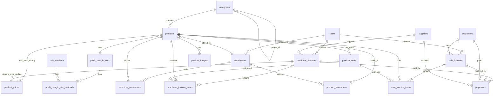

# 🗄️ تصميم قاعدة البيانات الكامل - نظام إدارة المتجر

## 📊 مخطط العلاقات (ERD)



---

## 📋 الجداول المطلوبة

### ✅ الجداول الموجودة حالياً
1. `users` - المستخدمين
2. `profit_margin_tiers` - الشرائح السعرية
3. `sale_methods` - طرق البيع
4. `profit_margin_tier_methods` - ربط الشرائح بطرق البيع
5. `warehouses` - المخازن
6. `settings` - الإعدادات

### 🆕 الجداول الجديدة المطلوبة

---

## 1️⃣ جداول المنتجات

### `categories` - التصنيفات
```sql
id                  BIGINT UNSIGNED PRIMARY KEY
parent_id           BIGINT UNSIGNED NULL (FK → categories.id)
name                VARCHAR(255) NOT NULL
slug                VARCHAR(255) UNIQUE NOT NULL
description         TEXT NULL
image               VARCHAR(255) NULL
is_active           BOOLEAN DEFAULT TRUE
sort_order          INTEGER DEFAULT 0
created_at          TIMESTAMP
updated_at          TIMESTAMP
```

**العلاقات:**
- Self-referencing (تصنيف رئيسي → تصنيفات فرعية)
- One-to-Many مع `products`

**Indexes:**
- `parent_id`, `slug`, `is_active`, `sort_order`

---

### `products` - المنتجات
```sql
id                      BIGINT UNSIGNED PRIMARY KEY
category_id             BIGINT UNSIGNED NULL (FK → categories.id)
warehouse_id            BIGINT UNSIGNED NULL (FK → warehouses.id) -- المخزن الافتراضي
profit_margin_tier_id   BIGINT UNSIGNED NULL (FK → profit_margin_tiers.id)

name                    VARCHAR(255) NOT NULL
slug                    VARCHAR(255) UNIQUE NOT NULL
sku                     VARCHAR(100) UNIQUE NOT NULL -- كود المنتج
barcode                 VARCHAR(100) UNIQUE NULL

description             TEXT NULL
short_description       VARCHAR(500) NULL

-- الأسعار الحالية (cached for performance)
-- تُحدّث تلقائياً من آخر فاتورة شراء
-- NULL إذا لم يتم شراء المنتج بعد
current_cost_price      DECIMAL(15,2) NULL -- سعر التكلفة الحالي
current_base_price      DECIMAL(15,2) NULL -- السعر الأساسي للحساب

-- الوحدة الأساسية
base_unit               VARCHAR(50) DEFAULT 'piece' -- kg, piece, liter, box

-- المخزون
stock_quantity          DECIMAL(10,3) DEFAULT 0 -- الكمية بالوحدة الأساسية
min_stock_level         DECIMAL(10,3) DEFAULT 0 -- الحد الأدنى للتنبيه
max_stock_level         DECIMAL(10,3) NULL -- الحد الأقصى

-- الصور
main_image              VARCHAR(255) NULL

-- الحالة
is_active               BOOLEAN DEFAULT TRUE
is_featured             BOOLEAN DEFAULT FALSE
track_inventory         BOOLEAN DEFAULT TRUE

-- SEO
meta_title              VARCHAR(255) NULL
meta_description        TEXT NULL
meta_keywords           TEXT NULL

created_at              TIMESTAMP
updated_at              TIMESTAMP
deleted_at              TIMESTAMP NULL
```

**العلاقات:**
- Many-to-One مع `categories`
- Many-to-One مع `warehouses`
- Many-to-One مع `profit_margin_tiers`
- One-to-Many مع `product_prices` (price history)
- One-to-Many مع `product_units` (وحدات البيع المتعددة)
- One-to-Many مع `product_images`
- Many-to-Many مع `warehouses` عبر `product_warehouse`

**Indexes:**
- `category_id`, `warehouse_id`, `profit_margin_tier_id`
- `sku`, `barcode`, `slug`
- `is_active`, `is_featured`

**ملاحظات:**
- `current_cost_price` و `current_base_price` يُحدّثان تلقائياً من آخر فاتورة شراء
- **NULL** إذا لم يتم شراء المنتج بعد (يمكن إضافة المنتج قبل الشراء)
- السعر النهائي للبيع يُحسب لحظياً عبر `PricingService` حسب طريقة البيع
- `base_unit` هي الوحدة الأساسية للمنتج (كيلو، قطعة، لتر)
- `stock_quantity` بالوحدة الأساسية (يتم التحويل التلقائي من الوحدات الأخرى)

---

### `product_prices` - تاريخ أسعار المنتجات
```sql
id                      BIGINT UNSIGNED PRIMARY KEY
product_id              BIGINT UNSIGNED NOT NULL (FK → products.id)
purchase_invoice_id     BIGINT UNSIGNED NULL (FK → purchase_invoices.id) -- الفاتورة المصدر
user_id                 BIGINT UNSIGNED NULL (FK → users.id) -- من قام بالتعديل

-- الأسعار
cost_price              DECIMAL(15,2) NOT NULL DEFAULT 0 -- سعر التكلفة
base_price              DECIMAL(15,2) NOT NULL DEFAULT 0 -- السعر الأساسي للحساب

-- التواريخ
effective_from          DATETIME NOT NULL -- تاريخ بداية السريان
effective_to            DATETIME NULL -- تاريخ نهاية السريان (NULL = حالي)

-- معلومات إضافية
is_current              BOOLEAN DEFAULT FALSE -- هل هو السعر الحالي؟
change_reason           ENUM('purchase', 'manual', 'promotion', 'adjustment') DEFAULT 'purchase'
notes                   TEXT NULL

created_at              TIMESTAMP
updated_at              TIMESTAMP
```

**العلاقات:**
- Many-to-One مع `products`
- Many-to-One مع `purchase_invoices` (مصدر التغيير)
- Many-to-One مع `users`

**Indexes:**
- `product_id`, `purchase_invoice_id`, `user_id`
- `effective_from`, `effective_to`, `is_current`
- Composite: `(product_id, is_current)` للأداء

**ملاحظات:**
- عند استلام فاتورة شراء، يتم إنشاء سجل جديد تلقائياً
- `purchase_invoice_id` يربط السعر بالفاتورة المصدر
- `change_reason = 'purchase'` للأسعار من الفواتير
- `change_reason = 'manual'` للتعديلات اليدوية
- السعر النهائي للبيع يُحسب عبر `PricingService` + `profit_margin_tiers`

---

### `product_units` - وحدات البيع المتعددة
```sql
id              BIGINT UNSIGNED PRIMARY KEY
product_id      BIGINT UNSIGNED NOT NULL (FK → products.id)

unit_name       VARCHAR(50) NOT NULL -- 'كيلو', 'شيكارة', 'كرتون', 'صندوق'
unit_name_en    VARCHAR(50) NULL -- 'kg', 'bag', 'carton', 'box'
unit_value      DECIMAL(10,3) NOT NULL -- 1 شيكارة = 25 كيلو
is_default      BOOLEAN DEFAULT FALSE -- الوحدة الافتراضية للبيع
barcode         VARCHAR(100) UNIQUE NULL -- باركود خاص بهذه الوحدة

created_at      TIMESTAMP
updated_at      TIMESTAMP

UNIQUE(product_id, unit_name)
```

**العلاقات:**
- Many-to-One مع `products`

**Indexes:**
- `product_id`, `is_default`, `barcode`

**ملاحظات:**
- `unit_value` يحدد قيمة الوحدة بالنسبة للوحدة الأساسية
- مثال: المنتج وحدته الأساسية `kg`، يمكن إضافة وحدة `bag` بقيمة `25` (أي 1 شيكارة = 25 كيلو)
- عند البيع بوحدة غير أساسية، يتم التحويل التلقائي للمخزون
- يمكن أن يكون لكل وحدة باركود خاص بها

---

### `product_images` - صور المنتجات
```sql
id              BIGINT UNSIGNED PRIMARY KEY
product_id      BIGINT UNSIGNED NOT NULL (FK → products.id)
image_path      VARCHAR(255) NOT NULL
alt_text        VARCHAR(255) NULL
sort_order      INTEGER DEFAULT 0
is_primary      BOOLEAN DEFAULT FALSE
created_at      TIMESTAMP
updated_at      TIMESTAMP
```

**العلاقات:**
- Many-to-One مع `products`

---

### `product_warehouse` - مخزون المنتجات في المخازن
```sql
id              BIGINT UNSIGNED PRIMARY KEY
product_id      BIGINT UNSIGNED NOT NULL (FK → products.id)
warehouse_id    BIGINT UNSIGNED NOT NULL (FK → warehouses.id)
quantity        INTEGER DEFAULT 0
reserved_quantity INTEGER DEFAULT 0 -- الكمية المحجوزة
available_quantity INTEGER GENERATED ALWAYS AS (quantity - reserved_quantity) STORED
created_at      TIMESTAMP
updated_at      TIMESTAMP

UNIQUE(product_id, warehouse_id)
```

**العلاقات:**
- Many-to-One مع `products`
- Many-to-One مع `warehouses`

---

## 2️⃣ جداول الموردين والعملاء

### `suppliers` - الموردين
```sql
id                  BIGINT UNSIGNED PRIMARY KEY
name                VARCHAR(255) NOT NULL
company_name        VARCHAR(255) NULL
email               VARCHAR(255) UNIQUE NULL
phone               VARCHAR(20) NOT NULL
phone_2             VARCHAR(20) NULL
address             TEXT NULL
city                VARCHAR(100) NULL
country             VARCHAR(100) DEFAULT 'Saudi Arabia'

-- معلومات مالية
tax_number          VARCHAR(50) NULL -- الرقم الضريبي
credit_limit        DECIMAL(15,2) DEFAULT 0 -- حد الائتمان
current_balance     DECIMAL(15,2) DEFAULT 0 -- الرصيد الحالي (مدين/دائن)

-- معلومات إضافية
notes               TEXT NULL
is_active           BOOLEAN DEFAULT TRUE

created_at          TIMESTAMP
updated_at          TIMESTAMP
deleted_at          TIMESTAMP NULL
```

**Indexes:**
- `email`, `phone`, `is_active`

---

### `customers` - العملاء
```sql
id                  BIGINT UNSIGNED PRIMARY KEY
name                VARCHAR(255) NOT NULL
email               VARCHAR(255) UNIQUE NULL
phone               VARCHAR(20) NOT NULL
phone_2             VARCHAR(20) NULL
address             TEXT NULL
city                VARCHAR(100) NULL
country             VARCHAR(100) DEFAULT 'Saudi Arabia'

-- معلومات مالية
tax_number          VARCHAR(50) NULL
credit_limit        DECIMAL(15,2) DEFAULT 0
current_balance     DECIMAL(15,2) DEFAULT 0

-- تصنيف العميل
customer_type       ENUM('individual', 'company') DEFAULT 'individual'
company_name        VARCHAR(255) NULL

-- معلومات إضافية
notes               TEXT NULL
is_active           BOOLEAN DEFAULT TRUE

created_at          TIMESTAMP
updated_at          TIMESTAMP
deleted_at          TIMESTAMP NULL
```

**Indexes:**
- `email`, `phone`, `customer_type`, `is_active`

---

## 3️⃣ جداول الفواتير

### `purchase_invoices` - فواتير الشراء
```sql
id                      BIGINT UNSIGNED PRIMARY KEY
invoice_number          VARCHAR(50) UNIQUE NOT NULL -- رقم الفاتورة
supplier_id             BIGINT UNSIGNED NOT NULL (FK → suppliers.id)
warehouse_id            BIGINT UNSIGNED NOT NULL (FK → warehouses.id)
user_id                 BIGINT UNSIGNED NOT NULL (FK → users.id) -- المستخدم الذي أنشأ الفاتورة

-- التواريخ
invoice_date            DATE NOT NULL
due_date                DATE NULL

-- المبالغ
subtotal                DECIMAL(15,2) NOT NULL DEFAULT 0 -- المجموع الفرعي
tax_amount              DECIMAL(15,2) DEFAULT 0 -- قيمة الضريبة
tax_percentage          DECIMAL(5,2) DEFAULT 0 -- نسبة الضريبة
discount_amount         DECIMAL(15,2) DEFAULT 0 -- قيمة الخصم
discount_percentage     DECIMAL(5,2) DEFAULT 0 -- نسبة الخصم
shipping_cost           DECIMAL(15,2) DEFAULT 0 -- تكلفة الشحن
total_amount            DECIMAL(15,2) NOT NULL DEFAULT 0 -- الإجمالي النهائي
paid_amount             DECIMAL(15,2) DEFAULT 0 -- المبلغ المدفوع
remaining_amount        DECIMAL(15,2) GENERATED ALWAYS AS (total_amount - paid_amount) STORED

-- الحالة
status                  ENUM('draft', 'pending', 'completed', 'cancelled') DEFAULT 'draft'
payment_status          ENUM('unpaid', 'partial', 'paid') DEFAULT 'unpaid'

-- ملاحظات
notes                   TEXT NULL
internal_notes          TEXT NULL -- ملاحظات داخلية

created_at              TIMESTAMP
updated_at              TIMESTAMP
deleted_at              TIMESTAMP NULL
```

**العلاقات:**
- Many-to-One مع `suppliers`
- Many-to-One مع `warehouses`
- Many-to-One مع `users`
- One-to-Many مع `purchase_invoice_items`
- One-to-Many مع `payments`

**Indexes:**
- `invoice_number`, `supplier_id`, `warehouse_id`, `user_id`
- `invoice_date`, `status`, `payment_status`

---

### `purchase_invoice_items` - تفاصيل فواتير الشراء
```sql
id                  BIGINT UNSIGNED PRIMARY KEY
purchase_invoice_id BIGINT UNSIGNED NOT NULL (FK → purchase_invoices.id)
product_id          BIGINT UNSIGNED NOT NULL (FK → products.id)
product_unit_id     BIGINT UNSIGNED NULL (FK → product_units.id) -- الوحدة المستخدمة في الشراء

quantity            DECIMAL(10,3) NOT NULL -- الكمية (يمكن أن تكون كسرية)
unit_price          DECIMAL(15,2) NOT NULL -- سعر الوحدة (سعر الشراء من المورد)
subtotal            DECIMAL(15,2) GENERATED ALWAYS AS (quantity * unit_price) STORED
tax_amount          DECIMAL(15,2) DEFAULT 0
discount_amount     DECIMAL(15,2) DEFAULT 0
total               DECIMAL(15,2) NOT NULL

notes               TEXT NULL

created_at          TIMESTAMP
updated_at          TIMESTAMP
```

**العلاقات:**
- Many-to-One مع `purchase_invoices`
- Many-to-One مع `products`
- Many-to-One مع `product_units` (الوحدة المستخدمة)

**ملاحظات:**
- `unit_price` هو سعر الوحدة المحددة (ليس بالضرورة الوحدة الأساسية)
- `quantity` يمكن أن تكون كسرية (5.5 كيلو مثلاً)
- عند حفظ الفاتورة، يتم إنشاء سجل في `product_prices` تلقائياً
- يتم تحديث `current_cost_price` و `current_base_price` في `products`

---

### `sale_invoices` - فواتير البيع
```sql
id                      BIGINT UNSIGNED PRIMARY KEY
invoice_number          VARCHAR(50) UNIQUE NOT NULL
customer_id             BIGINT UNSIGNED NOT NULL (FK → customers.id)
warehouse_id            BIGINT UNSIGNED NOT NULL (FK → warehouses.id)
user_id                 BIGINT UNSIGNED NOT NULL (FK → users.id)
sale_method_id          BIGINT UNSIGNED NULL (FK → sale_methods.id) -- طريقة البيع

-- التواريخ
invoice_date            DATE NOT NULL
due_date                DATE NULL

-- المبالغ
subtotal                DECIMAL(15,2) NOT NULL DEFAULT 0
tax_amount              DECIMAL(15,2) DEFAULT 0
tax_percentage          DECIMAL(5,2) DEFAULT 0
discount_amount         DECIMAL(15,2) DEFAULT 0
discount_percentage     DECIMAL(5,2) DEFAULT 0
shipping_cost           DECIMAL(15,2) DEFAULT 0
total_amount            DECIMAL(15,2) NOT NULL DEFAULT 0
paid_amount             DECIMAL(15,2) DEFAULT 0
remaining_amount        DECIMAL(15,2) GENERATED ALWAYS AS (total_amount - paid_amount) STORED

-- الأرباح
total_cost              DECIMAL(15,2) DEFAULT 0 -- إجمالي التكلفة
total_profit            DECIMAL(15,2) GENERATED ALWAYS AS (subtotal - total_cost) STORED

-- الحالة
status                  ENUM('draft', 'pending', 'completed', 'cancelled', 'returned') DEFAULT 'draft'
payment_status          ENUM('unpaid', 'partial', 'paid') DEFAULT 'unpaid'

-- ملاحظات
notes                   TEXT NULL
internal_notes          TEXT NULL

created_at              TIMESTAMP
updated_at              TIMESTAMP
deleted_at              TIMESTAMP NULL
```

**العلاقات:**
- Many-to-One مع `customers`
- Many-to-One مع `warehouses`
- Many-to-One مع `users`
- Many-to-One مع `sale_methods`
- One-to-Many مع `sale_invoice_items`
- One-to-Many مع `payments`

---

### `sale_invoice_items` - تفاصيل فواتير البيع
```sql
id                  BIGINT UNSIGNED PRIMARY KEY
sale_invoice_id     BIGINT UNSIGNED NOT NULL (FK → sale_invoices.id)
product_id          BIGINT UNSIGNED NOT NULL (FK → products.id)
product_unit_id     BIGINT UNSIGNED NULL (FK → product_units.id) -- الوحدة المباعة

quantity            DECIMAL(10,3) NOT NULL -- الكمية (يمكن أن تكون كسرية)
cost_price          DECIMAL(15,2) NOT NULL -- سعر التكلفة (من product_prices الحالي)
unit_price          DECIMAL(15,2) NOT NULL -- سعر البيع (محسوب عبر PricingService)
subtotal            DECIMAL(15,2) GENERATED ALWAYS AS (quantity * unit_price) STORED
tax_amount          DECIMAL(15,2) DEFAULT 0
discount_amount     DECIMAL(15,2) DEFAULT 0
total               DECIMAL(15,2) NOT NULL
profit              DECIMAL(15,2) GENERATED ALWAYS AS ((unit_price - cost_price) * quantity) STORED

notes               TEXT NULL

created_at          TIMESTAMP
updated_at          TIMESTAMP
```

**العلاقات:**
- Many-to-One مع `sale_invoices`
- Many-to-One مع `products`
- Many-to-One مع `product_units` (الوحدة المباعة)

**ملاحظات:**
- `unit_price` يُحسب لحظياً عبر `PricingService` حسب:
  - `current_base_price` من `products`
  - `profit_margin_tier` المرتبط بالمنتج
  - `sale_method` من الفاتورة
- `cost_price` يُنسخ من `current_cost_price` في `products`
- `quantity` بالوحدة المحددة (يتم التحويل للوحدة الأساسية عند تحديث المخزون)

---

## 4️⃣ جداول المخزون

### `inventory_movements` - حركات المخزون
```sql
id                  BIGINT UNSIGNED PRIMARY KEY
product_id          BIGINT UNSIGNED NOT NULL (FK → products.id)
warehouse_id        BIGINT UNSIGNED NOT NULL (FK → warehouses.id)
user_id             BIGINT UNSIGNED NOT NULL (FK → users.id)

-- نوع الحركة
movement_type       ENUM('in', 'out', 'transfer', 'adjustment', 'return') NOT NULL
reference_type      VARCHAR(50) NULL -- نوع المرجع (purchase_invoice, sale_invoice, etc.)
reference_id        BIGINT UNSIGNED NULL -- معرف المرجع

-- الكميات
quantity            INTEGER NOT NULL
quantity_before     INTEGER NOT NULL -- الكمية قبل الحركة
quantity_after      INTEGER NOT NULL -- الكمية بعد الحركة

-- القيمة المالية
unit_cost           DECIMAL(15,2) NULL
total_cost          DECIMAL(15,2) GENERATED ALWAYS AS (quantity * unit_cost) STORED

-- معلومات إضافية
notes               TEXT NULL
movement_date       DATETIME NOT NULL

created_at          TIMESTAMP
updated_at          TIMESTAMP
```

**العلاقات:**
- Many-to-One مع `products`
- Many-to-One مع `warehouses`
- Many-to-One مع `users`

**Indexes:**
- `product_id`, `warehouse_id`, `movement_type`, `movement_date`

---

## 5️⃣ جداول المدفوعات

### `payments` - المدفوعات
```sql
id                      BIGINT UNSIGNED PRIMARY KEY
payment_number          VARCHAR(50) UNIQUE NOT NULL

-- المرجع (فاتورة شراء أو بيع)
paymentable_type        VARCHAR(50) NOT NULL -- App\Models\PurchaseInvoice أو SaleInvoice
paymentable_id          BIGINT UNSIGNED NOT NULL

-- الطرف (مورد أو عميل)
payer_type              VARCHAR(50) NOT NULL -- App\Models\Supplier أو Customer
payer_id                BIGINT UNSIGNED NOT NULL

user_id                 BIGINT UNSIGNED NOT NULL (FK → users.id)

-- المبلغ
amount                  DECIMAL(15,2) NOT NULL
payment_method          ENUM('cash', 'bank_transfer', 'check', 'credit_card', 'other') NOT NULL

-- التواريخ
payment_date            DATE NOT NULL

-- معلومات إضافية
reference_number        VARCHAR(100) NULL -- رقم الشيك أو رقم التحويل
notes                   TEXT NULL

-- الحالة
status                  ENUM('pending', 'completed', 'cancelled') DEFAULT 'completed'

created_at              TIMESTAMP
updated_at              TIMESTAMP
deleted_at              TIMESTAMP NULL
```

**العلاقات:**
- Polymorphic مع `purchase_invoices` و `sale_invoices`
- Polymorphic مع `suppliers` و `customers`
- Many-to-One مع `users`

**Indexes:**
- `payment_number`, `paymentable_type`, `paymentable_id`
- `payer_type`, `payer_id`, `payment_date`, `status`

---

## 📊 ملخص الجداول

### الجداول الموجودة (6)
1. ✅ `users`
2. ✅ `profit_margin_tiers`
3. ✅ `sale_methods`
4. ✅ `profit_margin_tier_methods`
5. ✅ `warehouses`
6. ✅ `settings`

### الجداول الجديدة (15)
1. 🆕 `categories`
2. 🆕 `products`
3. 🆕 `product_prices` ⭐ **تاريخ الأسعار من فواتير الشراء**
4. 🆕 `product_units` ⭐ **وحدات البيع المتعددة**
5. 🆕 `product_images`
6. 🆕 `product_warehouse`
7. 🆕 `suppliers`
8. 🆕 `customers`
9. 🆕 `purchase_invoices`
10. 🆕 `purchase_invoice_items`
11. 🆕 `sale_invoices`
12. 🆕 `sale_invoice_items`
13. 🆕 `inventory_movements`
14. 🆕 `payments`
15. 🆕 `seo` (موجودة لكن قد تحتاج تعديل)

**إجمالي الجداول: 21 جدول**

---

## 🔑 القواعد المطبقة

### ✅ القيم المالية
- جميع الحقول المالية تستخدم `DECIMAL(15,2)` ❌ لا `FLOAT`

### ✅ Foreign Keys
- جميع العلاقات محددة بوضوح
- استخدام `onDelete` المناسب لكل علاقة

### ✅ Soft Deletes
- الجداول المهمة تستخدم `deleted_at`

### ✅ Indexes
- Indexes على الحقول المستخدمة في البحث والفلترة

### ✅ Computed Columns
- استخدام Generated Columns للحسابات التلقائية

### ✅ التسمية
- جميع الأسماء بالإنجليزية
- استخدام Snake Case

---

## 📝 ملاحظات مهمة

### 1. نظام الأسعار ⭐ **التصميم النهائي المعتمد**

#### الأسعار في جدول `products` (Cached):
- `current_cost_price` - سعر التكلفة الحالي
- `current_base_price` - السعر الأساسي للحساب
- **يُحدّثان تلقائياً** عند استلام فاتورة شراء جديدة

#### تاريخ الأسعار في `product_prices`:
- يتم إنشاء سجل جديد **تلقائياً** عند استلام فاتورة شراء
- `purchase_invoice_id` يربط السعر بالفاتورة المصدر
- `change_reason = 'purchase'` للأسعار من الفواتير
- `change_reason = 'manual'` للتعديلات اليدوية
- `is_current = true` للسعر الحالي فقط

#### حساب سعر البيع (لحظياً):
```php
// عند البيع، يتم حساب السعر لحظياً عبر PricingService:
$finalPrice = PricingService::calculate(
    basePrice: $product->current_base_price,
    saleMethodCode: $invoice->sale_method->code
);

// النتيجة تعتمد على:
// 1. current_base_price من products
// 2. profit_margin_tier المرتبط بالمنتج
// 3. sale_method من الفاتورة (cash, installment, credit)
```

#### مثال عملي:
```
1. استلام فاتورة شراء:
   - سعر الشراء: 100 ريال
   → إنشاء سجل في product_prices
   → تحديث current_cost_price = 100
   → تحديث current_base_price = 100

2. عند البيع نقداً:
   - PricingService يحسب السعر حسب الشريحة السعرية
   - مثلاً: الشريحة تضيف 20% للنقدي
   → سعر البيع = 120 ريال

3. عند البيع بالتقسيط:
   - نفس المنتج، نفس السعر الأساسي
   - الشريحة تضيف 30% للتقسيط
   → سعر البيع = 130 ريال
```

---

### 2. نظام الوحدات المتعددة ⭐ **جديد**

#### جدول `product_units`:
- يدعم وحدات بيع متعددة لنفس المنتج
- مثال: الأرز يُباع بالكيلو أو بالشيكارة (25 كيلو)

#### مثال عملي:
```sql
-- المنتج: أرز
-- base_unit = 'kg'
-- stock_quantity = 500 (كيلو)

-- الوحدات المتاحة:
INSERT INTO product_units VALUES
(1, 1, 'كيلو', 'kg', 1.000, true, NULL),
(2, 1, 'شيكارة', 'bag', 25.000, false, '123456789');

-- عند البيع:
-- 2 شيكارة = 2 × 25 = 50 كيلو
-- يتم خصم 50 كيلو من stock_quantity
```

---

### 3. تدفق العمل الكامل

#### عند استلام فاتورة شراء:
1. حفظ الفاتورة في `purchase_invoices`
2. حفظ الأصناف في `purchase_invoice_items`
3. لكل صنف:
   - إنشاء سجل في `product_prices` (مرتبط بـ `purchase_invoice_id`)
   - تحديث `current_cost_price` و `current_base_price` في `products`
   - تحديث المخزون في `product_warehouse`
   - تسجيل حركة في `inventory_movements`

#### عند البيع:
1. اختيار المنتج والوحدة (كيلو / شيكارة)
2. حساب السعر لحظياً عبر `PricingService`
3. حفظ الفاتورة في `sale_invoices`
4. حفظ الأصناف في `sale_invoice_items` مع:
   - `cost_price` من `current_cost_price`
   - `unit_price` المحسوب من `PricingService`
   - `product_unit_id` للوحدة المستخدمة
5. تحديث المخزون (بعد التحويل للوحدة الأساسية)
6. تسجيل حركة في `inventory_movements`

### 2. تتبع المخزون
- جدول `product_warehouse` لتتبع الكميات في كل مخزن
- جدول `inventory_movements` لتسجيل جميع الحركات

### 3. الفواتير
- حقول محسوبة تلقائياً (`remaining_amount`, `total_profit`)
- حالات واضحة للفاتورة والدفع
- ربط مع المدفوعات

### 4. المدفوعات
- علاقات Polymorphic للمرونة
- تتبع كامل لجميع المدفوعات

---

## 🎯 الخطوة التالية

بعد الموافقة على التصميم، سيتم:
1. إنشاء ملفات Migration لجميع الجداول
2. إنشاء Models مع العلاقات
3. إنشاء Seeders للبيانات التجريبية
4. إنشاء Factories للاختبار
